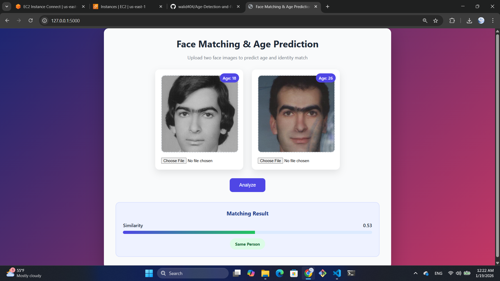

# Age Detection and Face Matching

A comprehensive deep learning project focused on **age prediction** and **face identity matching** using the FG-NET dataset. The project integrates age estimation with face recognition to enable age-aware identity verification. It follows a **two-stage** modeling approach, where the first stage predicts age using modern deep learning architectures such as **MobileNet**, and the second stage performs face identity matching using the **ArcFace** framework for robust and discriminative facial embeddings.

The project supports multiple inference interfaces:
- Command Line Interface (CLI)
- REST API (FastAPI)
- Web Interface (Flask UI)
- Docker Compose for containerized deployment

------------------------------------------------------------------------

## ✨ Features

- ✅ **Age Prediction**: CNN-based age estimation from facial images
- ✅ **Face Matching**: Identity verification using ArcFace embeddings
- ✅ **Multiple Model Architectures**: ResNet18/34/50, MobileNet, AlexNet, EfficientNet
- ✅ **Identity-Aware Data Splits**: Prevents identity leakage between train/val/test sets
- ✅ **CLI, API, and Web UI Inference**: Multiple ways to use the models
- ✅ **Docker & Docker Compose Support**: Easy containerized deployment
- ✅ **MLflow Tracking**: Comprehensive experiment logging and comparison
- ✅ **Threshold Optimization**: Automatic face matching threshold selection
- ✅ **Data Visualization**: EDA plots, identity distributions, loss curves, and predictions

------------------------------------------------------------------------

## 📥 Clone the Repository

```bash
git clone https://github.com/walid404/Age-Detection-and-Face-Matching.git
cd Age-Detection-and-Face-Matching
```

------------------------------------------------------------------------

## 📁 Project Structure

```
Age-Detection-and-Face-Matching/
├── app/
│   ├── API/
│   │   ├── main.py                     # FastAPI application
│   │   ├── client_request_sample.py    # API client example
│   │   ├── Dockerfile
│   │   ├── requirements.txt
│   │   └── core/
│   │       └── model_loader.py         # Model initialization
│   │   └── routes/
│   │       ├── base_route.py           # Base route handlers
│   │       └── age_face_route.py       # Age/Face matching endpoints
│   └── FlaskUI/
│       ├── main.py                     # Flask application
│       ├── config.py                   # Flask configuration
│       ├── Dockerfile
│       ├── requirements.txt
│       ├── BluePrint/
│       │   └── face_age_bp.py          # Blueprint for face/age routes
│       ├── static/
│       │   ├── style.css
│       │   └── generated_results/      # Output directory for generated results
│       └── templates/
│           └── face_age.html           # Web interface template
├── src/
│   ├── config/
│   │   └── config.yaml                 # Configuration file
│   ├── controller/                     # inference logic
│   │   ├── age_inference_controller.py
│   │   ├── age_face_inference_controller.py
│   │   ├── face_match_inference_controller.py
│   │   ├── face_match_evaluation_controller.py
│   │   ├── face_match_threshold_*.py
│   │   └── train_controller.py
│   ├── model/
│   │   ├── datasets/
│   │   │   ├── age_dataset.py          # PyTorch Dataset
│   │   │   ├── data_preparation.py     # Download & prepare data
│   │   │   ├── identity_split.py       # Identity-aware splitting
│   │   │   └── split_factory.py
│   │   ├── networks/
│   │   │   ├── age_models.py           # Age prediction models
│   │   │   ├── arcface_model.py        # Face embedding extraction
│   │   │   └── face_matcher.py         # Face matching logic
│   │   ├── training/
│   │   │   ├── trainer.py              # Training loop
│   │   │   ├── losses.py               # Loss functions
│   │   │   └── early_stopping.py       # Early stopping logic
│   │   └── utils/
│   │       ├── load.py                 # Image/model loading utilities
│   │       └── age_gap.py              # Age gap metrics
│   ├── scripts/
│   │   ├── prepare_data.py             # Dataset preparation
│   │   ├── age_inference.py            # Age prediction CLI
│   │   ├── face_age_inference.py       # Combined age + face matching CLI
│   │   ├── face_match_threshold_selection.py
│   │   ├── run_eda.py                  # EDA visualization
│   │   ├── run_full_experiment.py      # End-to-end pipeline
│   │   ├── compare_splits.py           # Split strategy comparison
│   │   ├── generate_mlflow_dashboard.py
│   │   └── generate_comparison_tables.py
│   ├── view/
│   │   ├── eda_plots.py                # EDA visualizations
│   │   ├── identity_distribution.py    # Identity distribution plots
│   │   ├── loss_plot.py
│   │   └── visualize_predictions.py    # Prediction samples
│   ├── Dataset/                        # (Downloaded during setup)
│   ├── saved_models/                   # Pre-trained model weights
│   ├── reports/
│   │   ├── plots/                      # Generated visualizations
│   │   └── tables/                     # Results tables (CSV)
│   └── requirements.txt                # Python dependencies
├── docker-compose.yml
├── requirements.txt
└── README.md
```

------------------------------------------------------------------------

## ⚙️ Setup & Installation

### Prerequisites

- Python 3.9+
- pip or conda
- CUDA 11.8+ (optional, for GPU acceleration)

### Installation

#### 2. Create Virtual Environment

```bash
python -m venv my_env

# Windows
my_env\Scripts\activate

# macOS / Linux
source my_env/bin/activate
```

#### 3. Install Dependencies

```bash
pip install -r requirements.txt
```

------------------------------------------------------------------------

## 🚀 Running the Project

### 1️⃣ Basic Usage --- CLI Inference (Age Prediction)

```bash
python -m src.scripts.age_inference \
  --image_path "src/image_samples/sample_image.jpg" \
  --model mobilenet \
  --checkpoint "src/saved_models/mobilenet_identity_bs16_lr0.0005_ep60.pt" \
  --img_size 224
```

📂 Generated results will be saved under:

```bash
src/generated_results/
```

------------------------------------------------------------------------

### 2️⃣ Advanced Usage --- REST API (FastAPI)

#### Start the API server

```bash
uvicorn app.API.main:app --host 0.0.0.0 --port 8000
```

#### Call the API using the provided client script

##### Windows (PowerShell)

```bash
python "app\API\client_request_sample.py" `
  --image1_path "src/image_samples/001A08.jpg" `
  --image2_path "src/image_samples/001A16.jpg" `
  --api_url "http://localhost:8000/v1/infer_age_and_match" `
  --threshold 0.25
```

##### Linux / macOS

```bash
python "app/API/client_request_sample.py" \
  --image1_path "src/image_samples/001A08.jpg" \
  --image2_path "src/image_samples/001A16.jpg" \
  --api_url "http://localhost:8000/v1/infer_age_and_match" \
  --threshold 0.25
```

#### Using curl

```bash
curl -X POST "http://localhost:8000/v1/infer_age_and_match" \
  -F "image1=@src/image_samples/001A08.jpg" \
  -F "image2=@src/image_samples/001A16.jpg" \
  -F "threshold=0.25"
```

------------------------------------------------------------------------

### 3️⃣ Flask Web UI

**Flask web interface for age detection and face matching:**

Start the Flask application:

```bash
python -m app.FlaskUI.main
```


Then open your browser and go to:

```text
http://localhost:5000
```

------------------------------------------------------------------------

## 🐳 Docker Compose Deployment

```bash
docker-compose up --build
```

Access the Flask UI at:

```text
http://localhost:5000
```

Access the FastAPI at:

```text
http://localhost:8000/docs
```

------------------------------------------------------------------------

## 📌 Notes

- **Generated Outputs**
  - CLI results are saved to:
    - `src/generated_results/`
    - `app/FlaskUI/static/generated_results/` (used by the Flask UI)

- **API Configuration**
  - When running the API or Flask UI on a remote machine, update the API base URL in client scripts and ensure the required ports are open and accessible.

- **Model Weights & Reproducibility**
  - This project relies on pre-trained model weights located at:
    - `src/saved_models/mobilenet_identity_bs16_lr0.0005_ep60.pt` (Age Prediction)
    - DeepFace ArcFace weights (automatically downloaded for Face Matching)
  - For reproducible results, ensure the same weights file is used across all environments (CLI, API, and Docker).


```bash
python src/scripts/age_inference.py \
  --image_path src/image_samples/001A08.jpg \
  --model mobilenet \
  --checkpoint src/saved_models/mobilenet_identity_bs16_lr0.0005_ep60.pt \
  --img_size 224
```

**Output**: Predicted age as integer

### 4. Run Full Experiment Pipeline

Execute the complete end-to-end pipeline:

```bash
python src/scripts/run_full_experiment.py
```

This will:
- Run EDA and generate plots
- Train multiple age prediction models with different configurations
- Compare random vs identity-aware data splits
- Generate MLflow dashboards and comparison tables

------------------------------------------------------------------------

## 📊 Training & Advanced Usage

### Configuration

Edit `src/config/config.yaml` to customize training:

```yaml
dataset:
  dataset_root: src/Dataset
  dataset_name: FGNET
  img_size: 224
  train_split: 0.7
  val_split: 0.1
  split_strategies: ["random", "identity"]

training:
  batch_size: [16, 32]
  epochs: [60]
  learning_rate: [0.0005]
  loss: mse
  patience: 5

models:
  names:
    - mobilenet
    - resnet18
    - efficientnet
```

### Data Preparation

The FG-NET dataset will be automatically downloaded during the first run:

```bash
cd src
python scripts/prepare_data.py \
  --dataset_root Dataset \
  --dataset_name FGNET
```

### Model Architectures

Supported age prediction models:
- **ResNet18/34/50**: Residual networks with different depths
- **MobileNet**: Lightweight for edge deployment
- **EfficientNet**: State-of-the-art efficiency
- **AlexNet**: Classic deep CNN

### View MLflow Results

```bash
mlflow ui --host 127.0.0.1 --port 5000
```

Open http://localhost:5000 in your browser.

------------------------------------------------------------------------

## 📈 Evaluation Metrics

**Age Prediction**:
- MAE (Mean Absolute Error)
- MSE (Mean Squared Error)
- RMSE (Root Mean Squared Error)
- R² Score

**Face Matching**:
- Accuracy
- Precision
- Recall
- F1-Score
- Similarity Score

------------------------------------------------------------------------

## 🔍 Additional Features

### Face Matching Threshold Selection

```bash
python src/scripts/face_match_threshold_selection.py \
  --dataset_root src/Dataset \
  --dataset_name FGNET \
  --thresholds 0.3 0.35 0.4 0.45 0.5 0.55 0.6 \
  --optimize_metric f1
```

### Compare Data Split Strategies

```bash
python src/scripts/compare_splits.py \
  --experiment_name Age_Prediction_Full_Comparison \
  --plots_dir src/reports/plots
```

------------------------------------------------------------------------

## 📝 Citation & References

- **FG-NET Dataset**: [Aging Database](https://yanweifu.github.io/FG_NET_data/)
- **ArcFace**: [Deepface implementation](https://github.com/serengil/deepface)
- **Age Prediction**: [Paper](https://www.sciencedirect.com/science/article/pii/S1877050924012663)